<h1 align="center">Hi 👋, I'm Smarika Sharma</h1>

  

### About me

- I love to build, especially AI that does the boring parts
- Worked at Software Engineer (AI) at **Varicon**, building multi-agent systems with **Google ADK**
- Computer Science at **IIMS College | Taylor's University**
- Currently exploring **machine learning**
- When I'm not coding, I'm planning the next trip
- Reach me at **smarikasharma89@gmail.com**

 

### Tech I work with

  

  
  
  
  
  
  
  
  
  
  

---

### Awards 

  
  
  

### GitHub stats

  

